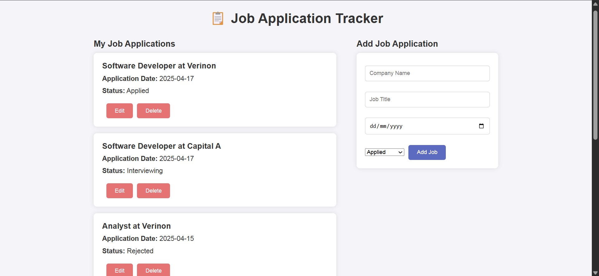

# Job Application Tracker🎯 
A simple full-stack web application to help you keep track of your job applications. Built with **React** (frontend), **FastAPI** (backend), and **PostgreSQL** (database). 

## ✨ Features 
- 📝 Add new job applications
- 📋 View a list of all job applications
- ✅ Update job status/details
- ❌ Delete job entries
- 📊 Responsive layout: Job list on the left, form on the right

## 📸 Overview 
Here's a screenshot of the web app:

## 🛠 Tech Stack 
#### Frontend 
- React (CRA)
- JavaScript
- HTML, CSS

#### Backend
- FastAPI
- SQLAlchemy (ORM)
- Pydantic

#### Database 
- PostgreSQL

#### Testing 
- Pytest
- FastAPI's TestClient
